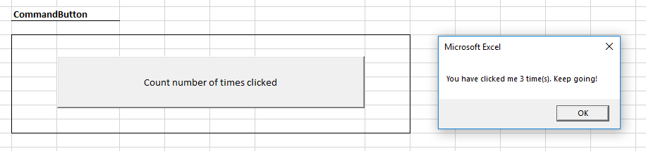

# ActiveX Controls Assignment

## Learning Objectives

  1. Gain exposure to programmatically-accessible interface controls in MS Excel.
  2. Find practical applications for learning new programming concepts like variables and conditionals.

## Instructions

Create a new macro-enabled workbook named **`net_id`-activex-controls.xlsm**, where `net_id` is your university-issued net identifier (i.e. the first part of your university-issued email address).

Rename the first sheet to "Interface". On the "Interface" sheet, create each of the following ActiveX Controls:

  1. **Command Button** (with a caption like "Count number of times clicked")
  2. **Combo Box** (with a list fill range of cells representing the list of selectable options, and a linked cell to display the currently selected value)
  3. **List Box** (with a list fill range of cells representing the list of selectable options, and a linked cell to display the currently selected value)
  4. **Toggle Button** (with a caption like "Toggle me!" and a linked cell to display the current value)
  5. **Spin Button** (with a linked cell to display the current value)
  6. **Scroll Bar** (with a linked cell to display the current value)
  7. **Option Buttons** (a related group of four, each with its own linked cell to display its current value)
  8. **Check Boxes** (a related group of four, each with its own linked cell to display its current value)

Revise the properties of these controls and write underlying VBA code as appropriate to implement each of the following programming challenges, and save the workbook after completing each.

### Challenges

#### Command Button Challenge

When the user clicks the "Count number of times clicked" button, the program should display a message like "You have clicked me `X` times", where `X` is the number of times the button has been clicked.

> Hint: declare a variable outside the scope of the button's click event subprocedure, and increment the variable's value from inside the scope of the click event subprocedure.

#### Combo Box Challenge

The user should be able to use a combo box to select one of at least three options. 

When the user selects an option from the combo box, the control's linked cell should update to display the selected option, and the program should display a message with the name of the selected option.

#### List Box Challenge

Repeat the combo box challenge above, but use a list box control instead.

#### Spin Button Challenge

The user should be able to use a spin button to increment or decrement an integer value between some specified acceptable range of values. 

When the user increments or decrements (i.e. "changes") the value, the control's linked cell should update to display the currently selected value, and the program should display a message like "You changed the value to: `X`", where `X` is the currently selected value.
  

#### Scroll Bar Challenges

Repeat the spin button challenge above, but use a scroll bar control instead.

#### Toggle Button Challenge

The user should be able to use a toggle button to represent either a pressed or unpressed state.

When the user toggles the button, the control's linked cell should update to display the currently selected value (e.g. `True` or `False`), and the program should display an alert which indicates whether its current state is "On" or "Off".

> Hint: inside the scope of the toggle button's click event subprocedure, use an `If` statement to check the value of the toggle button and respond accordingly.

#### Option Button Challenge

The user should be able to click any of the four option buttons to select one mutually exclusive option from among them.

When the user selects one of the option buttons:

  + All other option buttons should be de-selected.
  + Each control's respective linked cell should update to display its currently selected value (e.g. `True` or `False`). Use a different linked cell for each control.
  + The value of some specified cell should display the name or caption of the currently selected option. Display this value in the same cell, regardless of which control is selected.
  + The program should display an alert which indicates the name or caption of the currently selected option.

> Note: don't worry if this challenge results in some code duplication. After you learn about custom subprocedures and parameters, we can apply techniques for simplifying, or "refactoring" this code to remove duplication.

#### Check Box Challenge

Repeat the option button challenge above, but use check box controls instead.

And, instead of writing the name or caption of a single selected option to a specified cell, write a concatenated list of all selected options. The list doesn't need to be formatted in any particular way - a single space in between each selected option is sufficient.

> Hint: inside the scope of each check box control's click event subprocedure, use one or more `If` statements to check the values of each check box, and conditionally concatenate a string variable to include the name or caption of each control as appropriate.

> Note: don't worry if this challenge results in some code duplication. After you learn about custom subprocedures and parameters, we can apply techniques for simplifying, or "refactoring" this code to remove duplication.

## Submission Instructions

Upload your workbook file to Canvas:

  + [Section 40 Assignment Upload](https://georgetown.instructure.com/courses/54379/assignments/124042)
  + [Section 41 Assignment Upload](https://georgetown.instructure.com/courses/54380/assignments/124041)

## Evaluation Methodology

Submissions will be evaluated based on successful completion of component challenges:

challenge | weight
--- | ---
Command Button | 15%
Combo Box | 10%
List Box | 10%
Toggle Button | 15%
Spin Button | 10%
Scroll Bar | 10%
Option Buttons | 15%
Check Boxes | 15%
