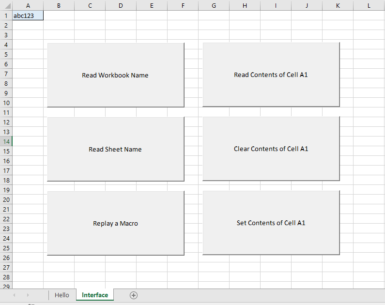

# Excel Objects Assignment

## Learning Objectives

  1. Gain exposure to programmatically-accessible objects and events in MS Excel.

## Instructions

Create a new macro-enabled workbook named **`net_id`-excel-objects.xlsm**, where `net_id` is your university-issued net identifier (i.e. the first part of your university-issued email address).

Create two worksheets in the workbook: one named "Hello" and the other named "Interface". On the "Interface" sheet, create six command buttons, and revise their properties to reflect the following captions:

  1. "Read Workbook Name"
  2. "Read Worksheet Name"
  3. "Replay a Macro"
  4. "Read Contents of Cell A1"
  5. "Clear Contents of Cell A1"
  6. "Set Contents of Cell A1"

In the workbook, implement each of the following programming challenges using VBA code, and save the workbook after completing each.

### Challenges

Challenges related to code underlying "ThisWorkbook":

  1. When the user opens the workbook, activate the "Hello" worksheet, display a welcome message, then activate the "Interface" worksheet.
  2. When the user closes the workbook, display a goodbye message.
  3. When the user resizes the workbook, display a custom message.
  
Challenges related to code underlying the "Interface" sheet:

  1. When the user clicks the "Read Workbook Name" button, display a message containing the name of the workbook, whatever it may be.
  2. When the user clicks the "Read Worksheet Name" button, display a message containing the name of the worksheet, whatever it may be.
  3. Record and save a new macro of you performing a simple task such as formatting one or more cells. When the user clicks "Replay a Macro", execute that macro programmatically.
  4. When the user clicks the "Read Contents of Cell A1" button, display a message containing the contents of cell A1, whatever they may be.
  5. When the user clicks the "Clear Contents of Cell A1" button, clear the contents of cell A1.
  6. When the user clicks the "Set Contents of Cell A1" button, set the contents of cell A1 to be some text like "abc123".

## Submission Instructions

Upload your workbook file to Canvas:

  + [Section 40 Assignment Upload](https://georgetown.instructure.com/courses/54379/assignments/124040)
  + [Section 41 Assignment Upload](https://georgetown.instructure.com/courses/54380/assignments/124039)

## Evaluation Methodology

Submissions will be evaluated based on successful completion of component challenges:

Challenge | Weight
--- | ---
Workbook Open Event | 15%
Workbook Close Event | 10%
Workbook Resize Event | 10%
Read Workbook Name | 10%
Read Worksheet Name | 10%
Replay Macro | 15%
Read Cell Value | 10%
Clear Cell Value | 10%
Write Cell Value | 10%

This rubric is tentative, and may be subject to slight adjustments during the grading process.
