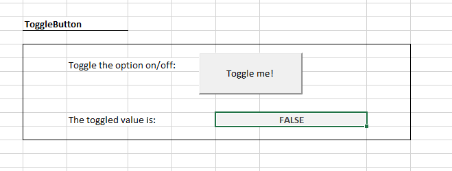

# MS Excel ActiveX Controls

## The `ToggleButton` Control

A button which maintains either a pressed or unpressed state (like a light switch).

Reference: [documentation](https://msdn.microsoft.com/en-us/VBA/Language-Reference-VBA/articles/togglebutton-control).

### Initialization

"Developer" > "Insert" > "ActiveX Controls" > "Toggle Button"

### Properties

name | description
--- | ---
`Caption` | Human-friendly text to instruct the user.
`Value` | The current state of the button (i.e. `True` if pressed, otherwise `False`).
`LinkedCell` | The address of a specified cell which is bidirectionally associated with control's value.

### Events

name | description
--- | ---
`Click` (default) | Triggers when the button is pressed or unpressed.
`Change` | Triggers when the button's value is changed. Triggers before the `Click` event in the control's event lifecycle.
