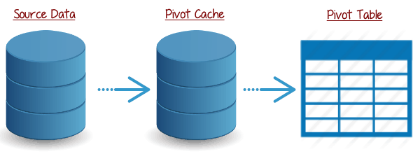

# MS Excel Objects

## Pivot Tables

The [`PivotTable`](https://msdn.microsoft.com/en-us/vba/excel-vba/articles/pivottable-object-excel) object represents a Pivot Table on a given worksheet.

Reference any `PivotTable` through the `PivotTables` collection:

```vb
Worksheets("Sheet1").PivotTables.Count '--> 2
Worksheets("Sheet1").PivotTables(1).Name ' --> PivotTable1
Worksheets("Sheet1").PivotTables(1).RefreshTable ' --> True
```

Once you have learned about loops, you can loop through each pivot table in the collection:

```vb
Dim MyPivot As PivotTable

For Each MyPivot In Worksheets("Sheet1").PivotTables
  MsgBox (MyPivot.Name)
Next MyPivot
```

### Pivot Caches

Sometimes you may need to programmatically update source data underlying a Pivot Table. A special object called the [`PivotCache`](https://msdn.microsoft.com/en-us/vba/excel-vba/articles/pivotcache-object-excel) represents this concept.



To update the Pivot Cache for a given Pivot Table, create a new Pivot Cache using `PivotCaches.Create()`, then pass that cache object into the Pivot Table's [`ChangePivotCache()` method](https://msdn.microsoft.com/en-us/vba/excel-vba/articles/pivottable-changepivotcache-method-excel):

```vb
Dim SourceDataRange as String
SourceDataRange = "Sheet1!A1:E5" ' <-- note this special construction which includes the sheet name followed by an exclamation mark, followed by the range address

Dim MyCache
Set MyCache = ThisWorkbook.PivotCaches.Create(SourceType:=xlDatabase, SourceData:=SourceDataRange)

Worksheets("Sheet1").PivotTables(1).ChangePivotCache(MyCache)
```
