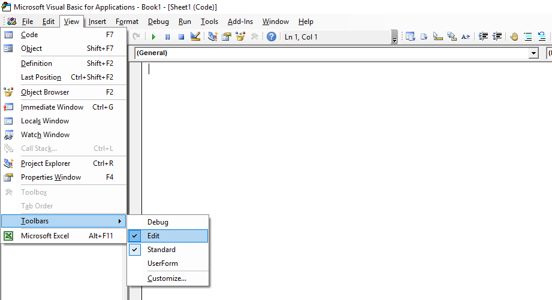

# Visual Basic Programming 

## Comments

Comments prevent certain code from being executed. This makes comments useful for debugging purposes.

Comments are also used by developers to [communicate](https://docs.microsoft.com/en-us/dotnet/visual-basic/programming-guide/program-structure/comments-in-code) with each other across space and time. They might explain why a certain line of code was written the way it is. A new developer may be more able to learn an existing code-base if the original authors have explained it well. In this way, well-commented code directly benefits business continuity.

Use a single quote to denote a single-line comment in VBA:

```vb
' this is a comment, written in English, not VBA!
```

```vb
MsgBox("Hello") ' this is also a comment
```

### Multi-line Comments

To add or remove multi-line comments, highlight all the lines you want to comment-out, then click the "Comment Block" or "Uncomment Block" menu buttons. 

```vb
'Private Sub MySub()
'
'End Sub
```

[To reveal these buttons](https://stackoverflow.com/questions/24001501/does-vba-contain-a-comment-block-syntax) open the Visual Basic Editor (VBE) and click "View" > "Toolbars" > "Edit".


