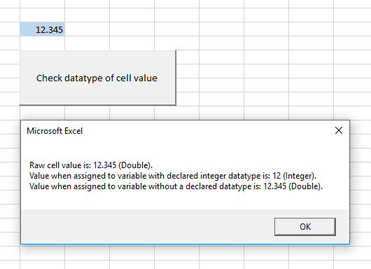
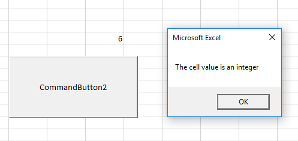
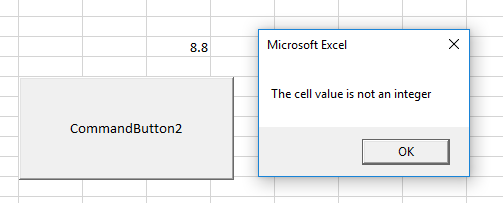

# Visual Basic Programming

## Datatypes

A computer program often allocates memory to store information for future reference. Some data is more "expensive" to store than others, so declaring [datatypes](https://msdn.microsoft.com/en-us/vba/language-reference-vba/articles/data-types) helps the program allocate memory in an efficient way.

Also, different datatypes each have their own unique methods and proprties. For example, the things you can do with numeric data are not the same things you can do with text.

Common basic datatypes include:

name | description
--- | ---
`Boolean` | A binary value of true or false.
[`String`](strings.md) | Textual information.
`Integer` | A positive whole number.
`Double` | A decimal number.
`Date` | A calendar date.
[`Array`](datatypes/arrays.md) | An ordered collection of other items.

In addition to these common programming datatypes, you can also think about each [Excel Object](/notes/excel-objects) and [ActiveX Control](/notes/active-x-controls/notes.md) as its own datatype, each with its own custom properties and methods.

<hr>

> Below this line there are advanced topics which you can feel free to come back to later, especially once you have studied how to handle and validate user inputs...

<hr>

### Checking a Variable's Type

Visual Basic supports a number of built-in functions to detect the datatype of any variable. These functions are especially helpful when validating user inputs.

[The `TypeName()` function](https://docs.microsoft.com/en-us/dotnet/visual-basic/programming-guide/language-features/early-late-binding/determining-object-type) returns a String value to indicate a variable's datatype.

```vb
TypeName(1) ' --> "Integer"
TypeName("Hello") ' --> "String"
TypeName(True) ' --> "Boolean"
TypeName(3.14) ' --> "Double"
TypeName(#10/31/2017#) ' --> "Date"
TypeName(Range("A1:A7")) ' --> "Range"

If TypeName("Hello") = "String" Then
  MsgBox("'Hello' is a string datatype")
End If
```

[The `VarType()` function](https://support.office.com/en-us/article/VarType-Function-1e08636c-1892-40c2-aff3-2b894389e82d) "returns an Integer indicating the subtype of a variable". See the function's reference document for a table mapping the resulting integers to corresponding datatypes.

```vb
VarType(1) ' --> 2
VarType("Hello") ' --> 8
VarType(True) ' --> 11
VarType(3.14) ' --> 5
VarType(#10/31/2017#) ' --> 7
VarType(Range("A1:A7")) ' --> 8204

If VarType("Hello") = 8 Then
  MsgBox("'Hello' is a string datatype")
End If
```

[The `IsNumeric()` function](https://msdn.microsoft.com/en-us/vba/language-reference-vba/articles/isnumeric-function) evaluates whether or not a variable "can be evaluated as number".

```vb
IsNumeric(1) ' --> True
IsNumeric(3.14) ' --> True
IsNumeric(True) ' --> True
IsNumeric("1") ' --> True
IsNumeric("3.14") ' --> True
IsNumeric("Hello") ' --> False
```

### Static Typing

One practical affect of specifying datatypes during variable declaration (a.k.a. "static-typing") is that VBA will try to convert an assigned value to the declared datatype if possible. This may be helpful in some cases, but detrimental in other cases.

```vb
Private Sub CommandButton1_Click()
    Dim MyInt As Integer ' note the specified datatype
    Dim MyVar ' note the omitted datatype

    MyInt = Range("B4").Value ' because we declared an integer datatype above, this assignment will convert the value to an integer
    MyVar = Range("B4").Value

    MsgBox ("Raw cell value is: " & Range("B4").Value & " (" & TypeName(Range("B4").Value) & ")." & vbNewLine & _
            "Value when assigned to variable with declared integer datatype is: " & MyInt & " (" & TypeName(MyInt) & ")." & vbNewLine & _
            "Value when assigned to variable without a declared datatype is: " & MyVar & " (" & TypeName(MyVar) & ")." _
    )
End Sub
```



### Datatypes of Numeric Cell Values

By default, any numeric value entered into a cell is automatically treated by VBA as being a `Double` datatype, even if the value looks like an `Integer` datatype (e.g. the number `6`). This behavior is not intuitive, and can make it more difficult to use the aforementioned datatype-checking functions to distinguish between `Double` and `Integer` cell values while at the same time preventing the values from being converted during variable assignment.

One solution for detecting whether a cell value is really an `Integer` is to use the `INT()` function to convert its value to an `Integer`, and then compare the resulting value with the original value. If the original value and the integer-converted-value are equal, then we know the original value is an `Integer` datatype.

```vb
Private Sub CommandButton2_Click()
    Dim MyVar ' omit datatype specification to prevent cell value from being converted when assigned
    MyVar = Range("D17").Value

    If Int(MyVar) = MyVar Then ' check if an integer-converted-value is the same as the original value
        MsgBox ("The cell value is an integer")
    Else
        MsgBox ("The cell value is not an integer")
    End If
End Sub
```





### Datatypes of `InputBox` Values

When you use an `InputBox` to capture a user input, beware the default datatype of the resulting value will be a `String`. If you would like to change the default datatype to be numeric, pass a `Type` parameter value of `1` and the resulting value will instead be a `Double`:

```vb
Dim MyInput
MyInput = Application.InputBox(prompt:="Please enter your birth year: ", Type:=1)
```
