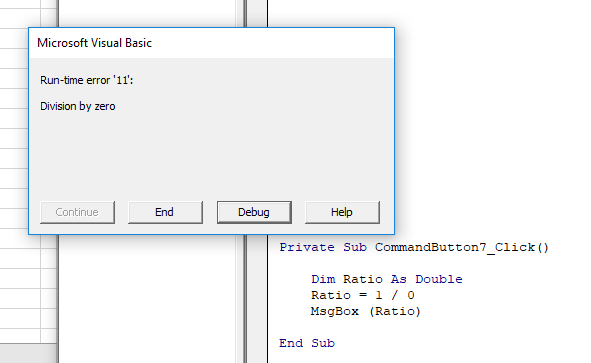
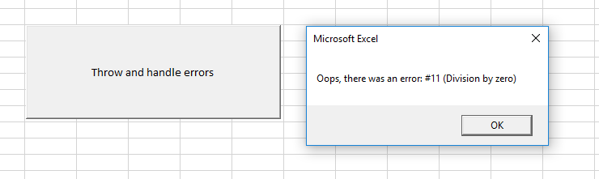

# VBA Language Overview

## Errors

Reference: [`On Error` docs](https://docs.microsoft.com/en-us/dotnet/visual-basic/language-reference/statements/on-error-statement).

Sometimes your program might encounter an error. When it does, the program will likely break.

```vb
Private Sub CommandButton7_Click()
    Dim Ratio As Double
    Ratio = 1 / 0 ' this code will throw an error which breaks the program
    MsgBox (Ratio)
End Sub
```



Usually, the error messages themselves are not always this clear. Some errors are obscure and may leave the user puzzled. This is not the best user experience. Plus, we don't want to allow the user to enter into "Debug" mode to look at our code.

Instead, our goal is to anticipate possible errors and help the program "fail gracefully". One way to do this in VBA is to use the `On Error` statement.

```vb
Private Sub CommandButton7_Click()
    On Error GoTo MyErrorHandler ' here, MyErrorHandler is a name we choose, which should correspond with a matching statement at the end of this sub-procedure's scope

    Dim Ratio As Double
    Ratio = 1 / 0 ' this will throw an error!
    MsgBox (Ratio)

    Exit Sub ' this line must be placed immediately before the error-handling logic, to prevent that logic from being executed in normal, non-error circumstances

MyErrorHandler: ' again, MyErrorHandler represents some name you choose, and it should match the GoTo statement referenced above

    ' code here will be executed if there is an error...
    ' in which case you get to reference the error as a variable named Err
    ' the error object has helpful properties like Number and Description

    MsgBox ("Oops, there was an error: #" & Err.Number & " (" & Err.Description & ")")
End Sub
```



If you would like to allow the user to try again and attempt to resume the program where it left off, you might explore using a [`Resume` statement](https://docs.microsoft.com/en-us/dotnet/visual-basic/language-reference/statements/resume-statement). 
