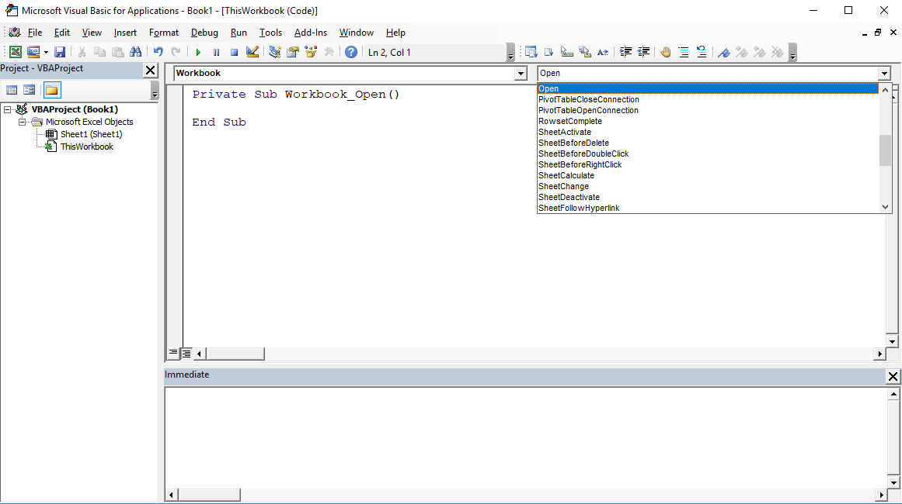

# Visual Basic Programming

## Getting Started

Follow this official [Getting Started with with VBA in Office](https://msdn.microsoft.com/en-us/vba/office-shared-vba/articles/getting-started-with-vba-in-office) tutorial, which provides an overview of VBA features and describes the process of [enabling the "Developer" menu](https://msdn.microsoft.com/en-us/vba/office-shared-vba/articles/getting-started-with-vba-in-office#to-enable-the-developer-tab) in MS Excel.

Take a moment to get familiar with the Visual Basic Editor (VBE) window, including the Project pane, and the various objects and events available via dropdown menus.

You may want to take this time to explore the various toolbars under "View" > "Toolbars".

Also take a moment to become familiar with various debugging options:

  + [The Immediate Window](https://msdn.microsoft.com/en-us/library/f177hahy.aspx)
  + [Using the Immediate Window](https://www.excelcampus.com/vba/vba-immediate-window-excel/)
  + [The Locals Window](https://msdn.microsoft.com/en-us/vba/language-reference-vba/articles/locals-window)
  + [Viewing Local Variables in the Locals Window](https://msdn.microsoft.com/en-us/library/aa238778)
  + [Trace Code Execution](https://msdn.microsoft.com/en-us/vba/language-reference-vba/articles/trace-code-execution)