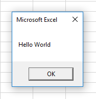

# Visual Basic Programming

## Message Boxes

Use VBA's built-in [`MsgBox` function](https://msdn.microsoft.com/en-us/library/aa445082.aspx) to alert the user. Pass a textual message as the function's primary parameter:

```vb
MsgBox("Hello World")
```

