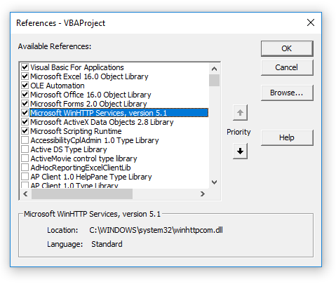
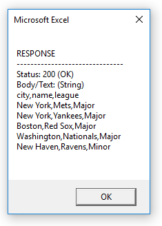

# VBA Language Overview

### Microsoft WinHTTP Services

> Before you read this document, please first read about [Computer Networks](/notes/information-systems/computer-networks.md) and [APIs](/notes/information-systems/apis.md).

Reference Documentation:

  + [Retrieving Data Using Script](https://msdn.microsoft.com/en-us/library/windows/desktop/aa384071)
  + [The `WinHttpRequest` Object](https://msdn.microsoft.com/en-us/library/windows/desktop/aa384106)

To use VBA to issue HTTP requests, you must first enable use of Microsoft WinHTTP Services from the VBE menu:
"Tools" > "References" > "Microsoft WinHTTP Services".



Then adapt the following example code to meet your specific needs:

```vb
Dim RequestURL As String
RequestURL = "https://raw.githubusercontent.com/prof-rossetti/georgetown-opim-557-20-201710/6f89cfbb0aaa544b457a2f56282a97ade92b8161/exercises/web-requests/teams.csv" ' Specify a URL pointing to some static data or some dynamic API endpoint.

Dim WinHttpReq As Object
Set WinHttpReq = CreateObject("WinHttp.WinHttpRequest.5.1") ' Initialize a new request object.

WinHttpReq.Open "GET", RequestURL, False ' Prepare a GET request to be sent to the specified URL. For me, using parentheses like ... WinHttpReq.Open("GET", RequestURL, False) ... caused an error, but omitting them bypassed the error.

WinHttpReq.Send ' Issue the request and wait for a response.

' After the request is issued and response received, the request object will yield relevant response properties like Status, StatusText, and ResponseText

MsgBox ("RESPONSE" & vbNewLine _
         & "-------------------------------" & vbNewLine _
         & "Status: " & WinHttpReq.Status & " (" & WinHttpReq.StatusText & ")" & vbNewLine _
         & "Body/Text: (" & TypeName(WinHttpReq.ResponseText) & ")" & vbNewLine _
         & WinHttpReq.ResponseText & vbNewLine _
)
```


