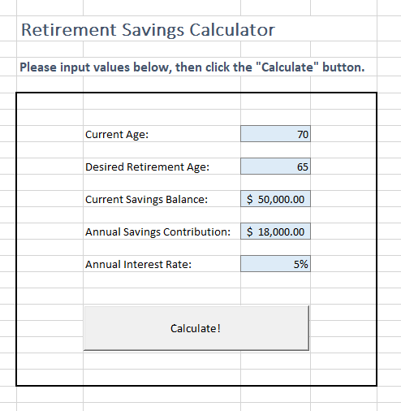
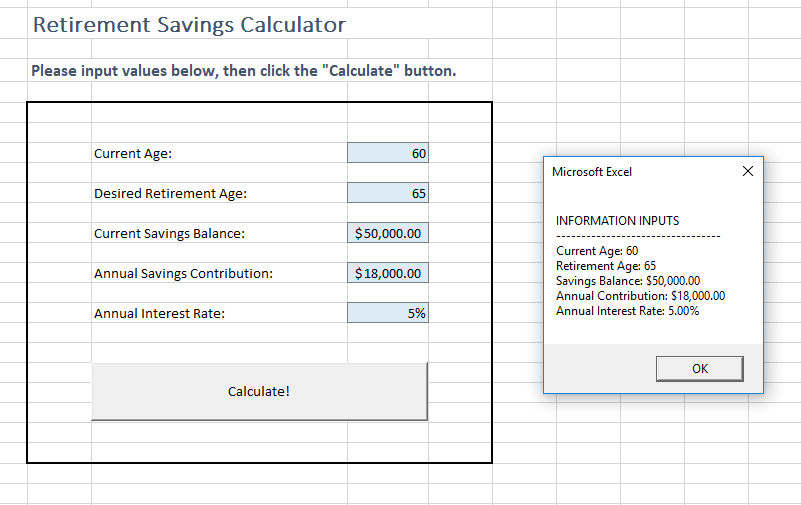
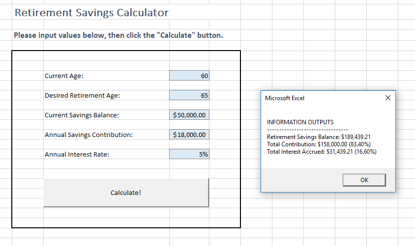
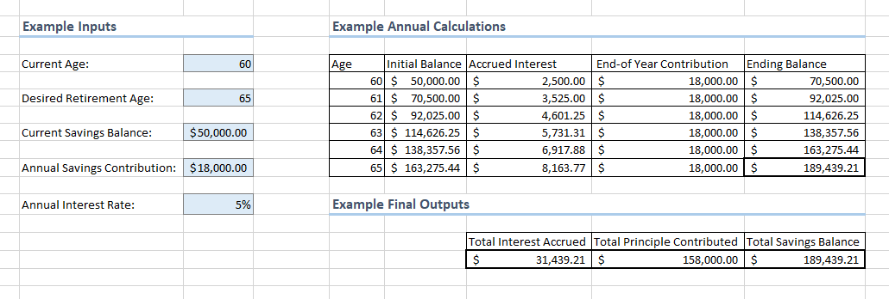

# Retirement Savings Calculator

> Adapted from a deliverable created by Professor Dillon-Merrill.

Assume you own and operate a financial planning business which helps customers plan for retirement. Your objective is to build yourself a tool to automate the common calculations required to provide your clients with retirement savings advice. Specifically, the system should accept a number of information inputs representing the client's savings goals, and should produce an information output representing the amount of money the client can expect to have saved upon reaching retirement age.

## Learning Objectives

  1. Design and build a tool to perform automated calculations and aid a decision-making process.
  2. Find practical applications for practicing new programming concepts, primarily loops.

  

## Instructions

Create a new macro-enabled workbook named **`net_id`-savings-calc.xlsm**, where `net_id` is your university-issued net identifier (i.e. the first part of your university-issued email address).

Rename the first sheet to "Interface".

Your submission should adhere to the following requirements, as detailed in the corresponding sections below:

  + Information Requirements
  + Interface Requirements
  + Validation Requirements
  + Calculation Requirements

### Information Requirements

#### Information Inputs

Your system should accept the following user inputs:

  1. The client's current age.
  2. The client's desired retirement age.
  3. The client's current amount of savings (a.k.a. initial savings balance). Assume the client does not have any debt.
  4. The amount of money the client plans to contribute to savings each year. Assume contributions are made at the end of each year, after interest has been accrued.
  5. A projected annual growth rate for the client's savings (a.k.a the interest rate). Assume interest will compound on an annual basis (at the end of each year), not on a monthly basis.

The table below provides a framework for you to translate these information inputs into VBA variables.

info input | suggested variable name | variable datatype | example value
--- | ---  | ---  | ---
Current Age | `Age` | `Integer` | `60`
Desired Retirement Age | `RetirementAge` | `Integer` | `65`
Initial Savings Balance | `InitialBalance` | `Double` | `50000.00`
Annual Savings Contribution | `AnnualContribution` | `Double` | `18000.00`
Annual Savings Growth Rate (Interest Rate) | `InterestRate` | `Double` | `0.05`

#### Information Outputs

Your system should produce the following outputs:

  1. The final savings balance at the end of the year when the client reaches the specified retirement age.
  2. The portion of the final savings balance which was contributed directly by the client.
  3. The portion of the final savings balance resulting from accrued interest on the principal.

The table below provides a framework for you to translate these information inputs into VBA variables.

info output | suggested variable name | variable datatype | example value
--- | ---  | ---  | ---
Final Savings Balance | `SavingsBalance` | `Double` | `189439.21`
Total Savings Contribution | `TotalContribution` | `Double` | `158000.00`
Total Interest Accrued | `InterestAccrued` | `Double` | `31439.21`

See the "Calculation Requirements" section below for more information about how to calculate these information outputs.

### Interface Requirements

Provide written instructions which explain how to use the tool.

Use cells and/or input boxes and/or ActiveX Controls to capture user inputs, as appropriate. You may draw inspiration from any of these [expample interfaces](example-interfaces.md). But beware, some interface elements may be more appropriate than others, and your job is to choose the interface elements that will provide the best user experience.

Regardless of how you choose to capture user inputs, make sure the user sees only properly-formatted values. Rates should be formatted with a percent sign (`%`) and dollar amounts should be formatted as USD with a dollar sign (`$`) and two decimal places.

Use an ActiveX command button control that when clicked will read and validate the inputs, perform the calculations, and produce the outputs. Outputs should also be properly formatted (see above).

At no time should previously-generated outputs be visible at the same time as yet-to-be used inputs. The user should not be able to take a screenshot of the application which depicts mismatching inputs and output values. If you have questions about this, ask the professor for clarifications.

### Validation Requirements

Prevent the user from inputting invalid values (i.e. entering a value of the wrong data type, entering a value outside of a reasonable range of accepted values, etc.).

If a user enters an invalid input, exit from the program and display a friendly message describing what went wrong and how the user can fix the problem.

### Calculation Requirements

The figure below depicts an example of the system's desired calculations. It is NOT meant to depict the user interface, the way the system captures inputs, or the way the system produces outputs. It is also NOT meant to depict the manner in which the system performs calculations, because the calculations should be performed using VBA, not cell formulae. For clarification, the program does not need to write cell values like this. Again, this is just an example to help you test to make sure your calculations are producing the expected results.

#### Annual Calculations

The savings balance at the end of any given year is equal to the initial savings balance for that year, plus the amount of accrued interest for that year, plus the end-of-year contribution.

The amount of accrued interest for any given year is equal to the initial savings balance for that year times the annual interest rate. Note: the end-of-year contribution does not accrue interest during the year it is contributed.

The initial savings balance for any given year is equal to the ending savings balance from the previous year.

#### Final Outputs

The final savings balance output by the system should reflect the balance at the end of the year when the client hits the desired retirement age. For example, if the desired retirement age is 65, the program should output the savings balance at the end of that year, after that year's interest accrual and savings contribution are calculated (see "Annual Calculations" above).

The final amount of interest accrued is equal to the sum of interest accrued during each year.

The final amount of principal contributed is equal to the very first savings balance input by the user, plus the sum of all end-of-year contributions. The amount of principal is also alternatively equal to the final savings balance, less the final amount of accrued interest.

## Submission Instructions

Upload your workbook file to Canvas:

  + [Section 40 Project Upload](https://georgetown.instructure.com/courses/54379/assignments/123534)
  + [Section 41 Project Upload](https://georgetown.instructure.com/courses/54380/assignments/123536)

## Evaluation Methodology

Submissions will be evaluated based on ability to meet each of the component requirements (see corresponding sections above for detailed instructions):

Category | Weight
--- | ---
File Naming | 4%
Information Requirements | 30%
Interface Requirements | 25%
Validation Requirements | 21%
Calculation Requirements | 20%

This rubric is tentative, and may be subject to slight adjustments during the grading process. 

The professor reserves the right to award extra credit in recognition of particularly effective user experiences. Common elements that may be eligible for extra credit include: simplicity of user interface, clarity of user instructions, presence of auto-updating charts and graphics, and the ability to programmatically and iteratively write annual calculation details to a separate sheet.